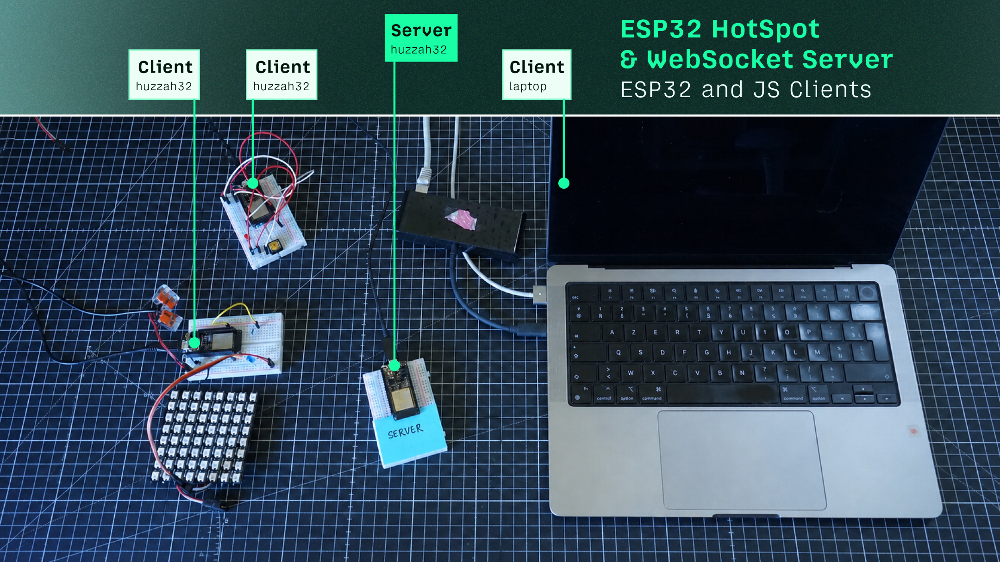
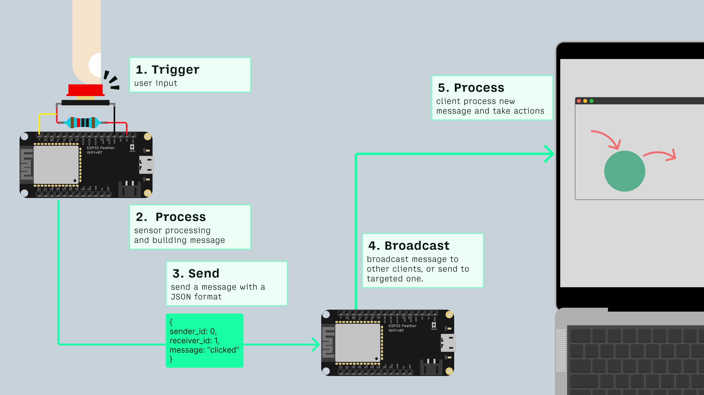
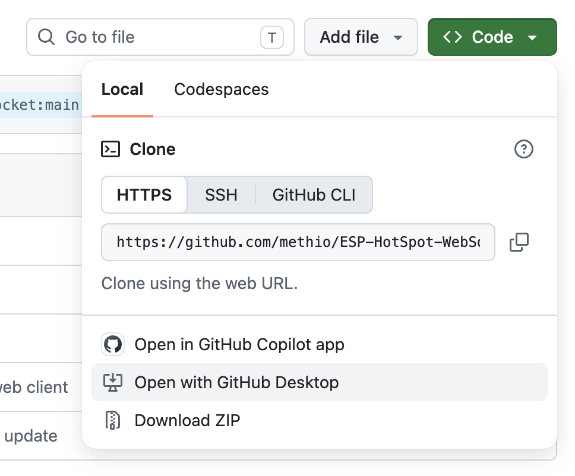
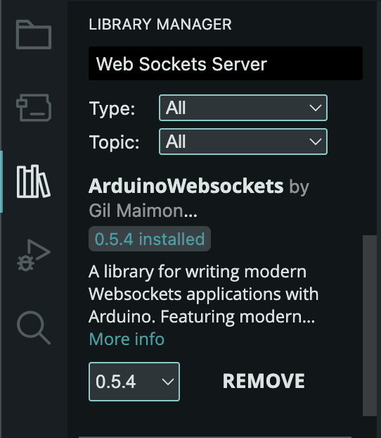
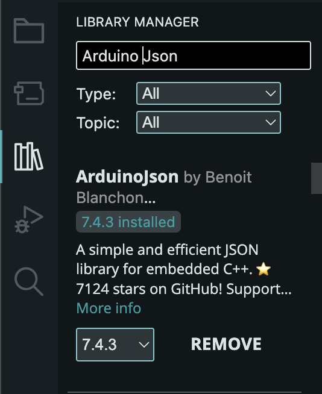
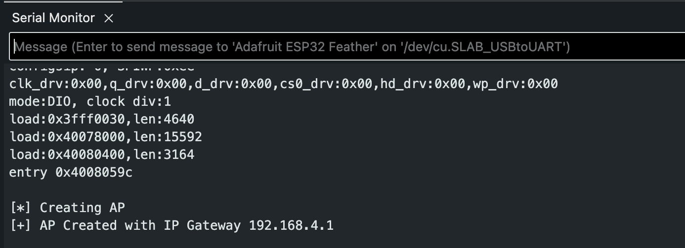
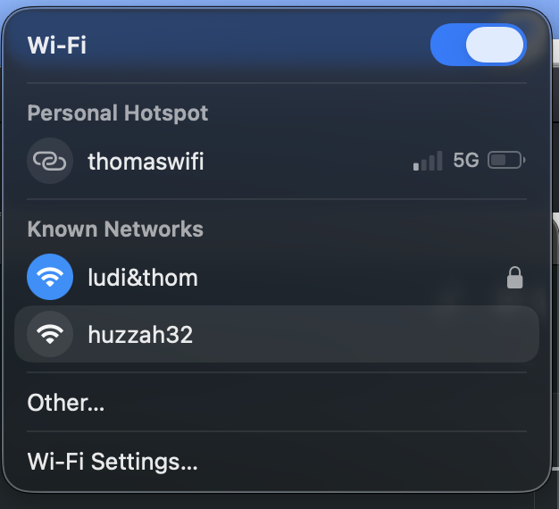

# ESP HotSpot and WebSocket Server + ESP and JS Clients

>[!TIP]
>You can use this repo/project when adafruit.io doesn't fit to your needs. 

This project turns your huzzah 32 ([Adafruit Feather Huzzah32↗](https://www.adafruit.com/product/3405) or [Adafruit Feather Huzzah(ESP 8266)↗](https://www.adafruit.com/product/2821)) into a **WiFi hotspot** and a **WebSocket server**. The Huzzah32 creates its own WiFi network, and every device connected to that network (other Huzzah32 and computers) can exchange messages in real time via WebSockets.

## Table of content
 - [💡 useful concepts](#-usefuls-concepts)
    - [hotspot](#wifi-access-point-hotspot--access-point)
    - [client and server](#client--server)
    - [webSocket](#websocket)
    - [SSID/password](#ssid--password)
 - [🤖 how does it works](#how-does-it-works)
 - [🧑🏻‍💻 setup](#-step-by-step-setup)
    - [clone this repo](#1️⃣-clone-this-repo)
    - [install arduino libraries](#2️⃣-install-arduino-libraries)
    - [setup the server](#3️⃣-setup-the-server)
    - [flash the server](#4️⃣-flash-the-server)
    - [flash a huzzah32 client](#5️⃣-flash-one-or-more-clients)
    - [connect to the server's hotspot from your computer](#6️⃣-connect-to-the-hotspot-from-a-computer)
    - [launch the web client](#7️⃣-launch-the-web-client)
    - [test an exchange](#8️⃣-test-the-exchanges)
 - [troubleshooting](#troubleshooting)
 - [sources](#sources)

## 💡 Usefuls concepts

### WiFi access point (Hotspot / Access Point)
Normally, your huzzah 32 connects to an existing WiFi network (like your smartphone hotspot). Here it's the opposite: the huzzah 32 **creates its own WiFi network**, which other devices then connect to. This is called an "access point" (AP) or "hotspot".

### Client / Server
- The **server** is the program that waits for connections and centralizes the exchanges (here, the huzzah 32 running `ESP_Server`).
- A **client** is a program that connects to the server to send or receive information (here, the other huzzah 32 boards `ESP_Clients` or a web page running on your laptop `Web_Client`).

### WebSocket
[Websocket↗](https://github.com/Links2004/arduinoWebSockets) is a communication protocol that keeps a connection **open at all times** between a client and a server, unlike classic HTTP where every exchange requires a new request. This allows instant two-way communication.

### SSID / Password
The SSID is simply the **name of the WiFi network**. Here, all huzzah32 boards must use the same SSID and password so they can find each other on the same network.

## 🤖 How does it works

At least 3 elements : server - client 1 - client 2
Server receives messages from one client and broadcast it to all clients. 
-gif schema connexion-



## 🧑🏻‍💻 step-by-step setup

### 1️⃣ Clone this repo

Although this step is optional, I recommend cloning this repository to your computer for convenience.

<picture>
    
</picture>

### 2️⃣ Install arduino libraries

Open your Arduino IDE and install the following libraries (install latest version available).

| ArduinoWebsockets by Gil Maimon | ArduinoJson by Benoit Blanchon |
| ------- | ------- |
|  |  |

### 3️⃣ Setup the server

Start by **configuring the network credentials**. 
In  [`ESP_Hotspot_WebSocket_Server.ino`↗](ESP_Hotspot_WebSocket_Server/ESP_Hotspot_WebSocket_Server.ino) file, find these lines and customize them with your name. 

> [!TIP]
> Replace `"huzzah32"` with your own name to avoid conflicts if other groups are using the same code at the same time.

```cpp
// The default credentials are currently set as follows:
const char *ssid = "huzzah32";
const char *password = "huzzah32";

// Replace these values with credentials unique to your project. 
// Do not use spaces or special characters.
const char *ssid = "thomasHotspot";
const char *password = "thomasHotspot";
```

### 4️⃣ Flash the server
- Open `ESP_Hotspot_WebSocket_Server.ino` file in the Arduino IDE
- Connect a huzzah32 to your computer
- Select the correct board and port in the Tools menu
- Upload the sketch to your "server" huzzah32
- Open the serial monitor to check that the hotspot was created (you should see an IP address printed as in the screenshot below)

<picture>
    
</picture>

### 5️⃣ Flash one or more clients
- Open one example from [ESP_CLIENTS↗](ESP_CLIENTS/)
- Modify the example according to your needs
- [Make sure the SSID/password match the server's↗](#3️⃣-setup-the-server)
- Upload the sketch to your "client" Huzzah32(s)

> [!IMPORTANT]
> 👇🏻 Optionnal steps, if you need a web client (on your computer).

### 6️⃣ Connect to the hotspot from a computer
On your computer, go to your WiFi settings and connect to the network created by the server ESP (the SSID you set in step 3).

> [!TIP]
> A new hotspot should be available in your wifi <br>
> <picture>
    
</picture>

### 7️⃣ Launch the web client
- Open the `WebClient` folder
- Modify the example according to your needs
- Serve the page with **Live Server** extension (go live, bottom right of your VS code interface)
- The page should connect automatically to the ESP's WebSocket server

### 8️⃣ Test the exchanges
Send a message from one client (button, web page...) and check that it's received and rebroadcast to all other connected clients.

## Troubleshooting
⚠️ Chrome now treats `localhost` as an insecure origin unless using a HTTPS certificate and will block usage of websockets. You can still modify this behavior by activating this chrome flag: `chrome://flags/#unsafely-treat-insecure-origin-as-secure`

## Sources
- https://www.upesy.fr/blogs/tutorials/how-create-a-wifi-acces-point-with-esp32
- https://shawnhymel.com/1675/arduino-websocket-server-using-an-esp32/


